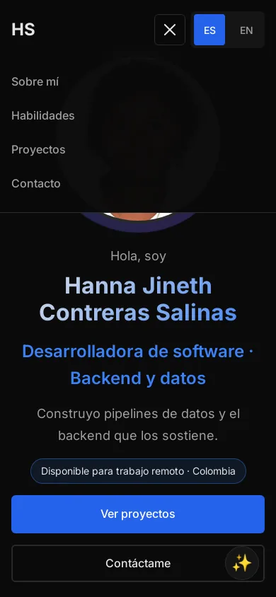

# Portafolio · Hanna Salinas

Sitio personal de Hanna Salinas, desarrolladora de software enfocada en backend y datos. Reúne sus proyectos destacados, habilidades, experiencia y CV, en español e inglés.

**[hannasalinas.github.io](https://hannasalinas.github.io/)**


## Contenido

- **Proyectos** con el problema que resuelven, el rol de Hanna, el stack y los enlaces al repositorio y a la demo o captura: Terrall, Wanderbricks Lakehouse, TalentCorp HR Data Warehouse, sistema académico en MongoDB, LocalRent y análisis multivariado.
- **Habilidades** agrupadas por lenguajes, datos y herramientas, más lo que está aprendiendo.
- **Experiencia** freelance y formación.
- **CV** descargable en PDF.


<p>
  
  
</p>

## Características

- HTML, CSS y JavaScript sin frameworks ni paso de compilación.
- Bilingüe (ES/EN) con archivos de traducción en `lang/`; recuerda el idioma elegido.
- Diseño adaptable con menú desplegable en móvil y objetivos táctiles de al menos 44 px.
- Accesibilidad: enlace para saltar al contenido, etiquetas accesibles traducidas y contraste AA.
- Favicon y etiquetas Open Graph para la vista previa al compartir en LinkedIn o WhatsApp.
- Imágenes en WebP (la foto pesa 24 KB).

Resultado de Lighthouse en local: rendimiento 90 (móvil) y 96 (escritorio); accesibilidad, buenas prácticas y SEO en 100.

## Estructura

```
├── index.html
├── styles.css
├── script.js            # Idioma, menú móvil, filtros de proyectos y modal
├── lang/
│   ├── es.json
│   └── en.json
├── assets/images/       # Foto, miniaturas de proyectos, imagen Open Graph y CV
├── favicon.svg
└── docs/capturas/       # Capturas usadas en este README
```

## Ejecutar en local

Las traducciones se cargan con `fetch`, así que hace falta un servidor (abrir `index.html` directamente no funciona):

```bash
git clone https://github.com/HannaSalinas/HannaSalinas.github.io.git
cd HannaSalinas.github.io
python3 -m http.server 8000   # http://localhost:8000
```

El sitio se publica con GitHub Pages desde la rama `main`.

## Contacto

- Correo: salinashanna123@gmail.com
- LinkedIn: [linkedin.com/in/hannacontreras](https://linkedin.com/in/hannacontreras)
- GitHub: [@HannaSalinas](https://github.com/HannaSalinas)

## Licencia

Código bajo licencia [MIT](LICENSE). La foto y el CV son personales y no están cubiertos por la licencia.
