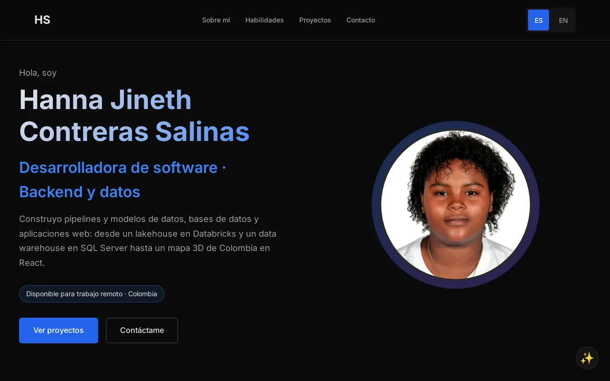
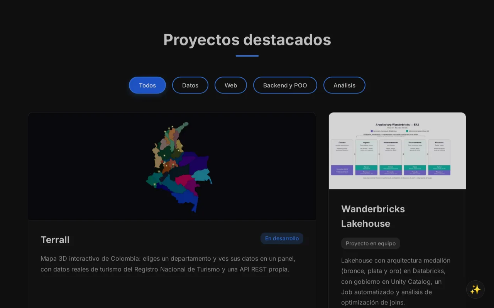
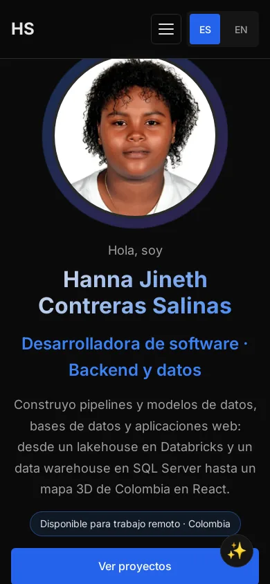

# Portafolio · Hanna Salinas

Sitio personal de Hanna Salinas, desarrolladora de software. Hace apps web del frontend a los datos y su meta es ser full-stack. Reúne sus proyectos, experiencia y CV, en español e inglés.

**[hannasalinas.github.io](https://hannasalinas.github.io/)**



## Contenido

- **Portada 3D** hecha con Three.js: un cuarto con escritorio, monitor que escribe código, letrero de neón y destellos rojos. El personaje está modelado a partir de una foto real; saluda al entrar y al hacer clic sobre él.
- **Sobre mí** con experiencia, estudios y herramientas.
- **Proyectos**: Terrall, Wanderbricks Lakehouse, TalentCorp HR Data Warehouse y análisis multivariado, más el sistema académico en MongoDB, LocalRent y la API de Terrall.
- **Contacto** y CV descargable en PDF.





## Características

- HTML, CSS y JavaScript sin frameworks ni paso de compilación; Three.js se carga desde un CDN.
- Personaje 3D construido solo con figuras básicas (`js/personaje.js`): respira, parpadea, sigue el cursor con la mirada y saluda.
- Bilingüe (ES/EN): se elige según el idioma del navegador y recuerda la elección.
- Si el navegador no puede mostrar 3D, la portada muestra una imagen del cuarto.
- Respeta la preferencia de reducir movimiento del sistema.
- Etiquetas Open Graph para la vista previa al compartir en LinkedIn o WhatsApp.

## Estructura

```
├── index.html
├── styles.css
├── js/
│   ├── main.js          # Idioma, destellos del cursor, terminal y animaciones al bajar
│   ├── escena.js        # Cuarto 3D, luces, partículas e interacción
│   └── personaje.js     # Personaje 3D y sus animaciones
├── assets/images/       # Foto, miniaturas de proyectos, imagen de respaldo, Open Graph y CV
├── favicon.svg
└── docs/capturas/       # Capturas usadas en este README
```

## Ejecutar en local

Los módulos de JavaScript necesitan un servidor (abrir `index.html` con doble clic no carga el 3D):

```bash
git clone https://github.com/HannaSalinas/HannaSalinas.github.io.git
cd HannaSalinas.github.io
python3 -m http.server 8000   # http://localhost:8000
```

El sitio se publica con GitHub Pages desde la rama `main`.

## Contacto

- Correo: salinashanna123@gmail.com
- LinkedIn: [linkedin.com/in/hannacontreras](https://linkedin.com/in/hannacontreras)
- GitHub: [@HannaSalinas](https://github.com/HannaSalinas)

## Licencia

Código bajo licencia [MIT](LICENSE). La foto y el CV son personales y no están cubiertos por la licencia.
